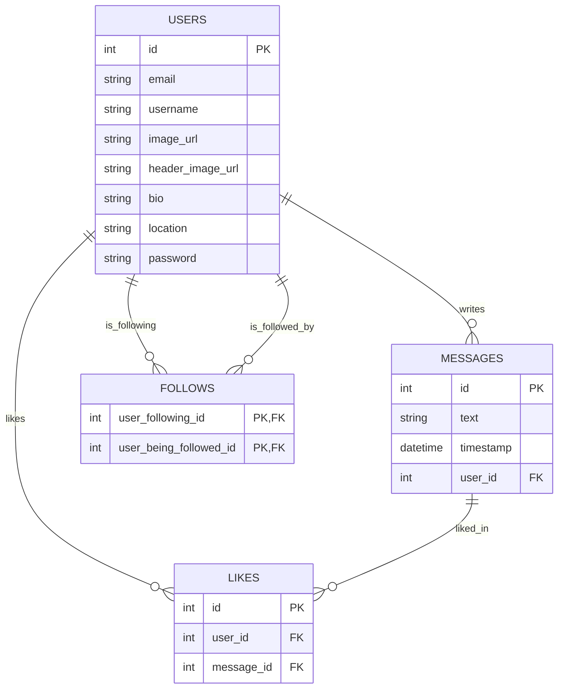

# Database Schema Diagram

```mermaid
erDiagram

    USERS ||--o{ MESSAGES : writes
    USERS ||--o{ LIKES : "likes"
    USERS ||--o{ FOLLOWS : "is_following"
    USERS ||--o{ FOLLOWS : "is_followed_by"
    MESSAGES ||--o{ LIKES : "liked_in"

    USERS {
        int id PK
        string email
        string username
        string image_url
        string header_image_url
        string bio
        string location
        string password
    }

    MESSAGES {
        int id PK
        string text
        datetime timestamp
        int user_id FK
    }

    FOLLOWS {
        int user_following_id PK, FK
        int user_being_followed_id PK, FK
    }

    LIKES {
        int id PK
        int user_id FK
        int message_id FK
    }
```